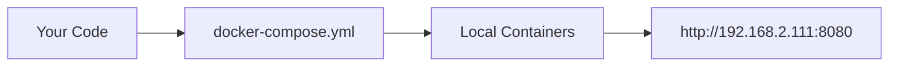
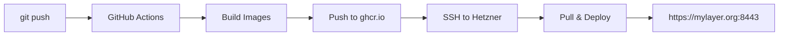

# 🚀 GitHub Actions Deployment Solution - Complete Overview

This solution provides **automatic deployment** from GitHub to your Hetzner server while maintaining full compatibility with local development.

## 📁 Files Created/Updated

| File | Purpose | Usage |
|------|---------|-------|
| `.github/workflows/deploy.yml` | GitHub Actions workflow | Builds images & deploys to Hetzner |
| `docker-compose.prod.yml` | Generic production setup | Alternative production config |
| `docker-compose.hetzner-github-actions.yml` | **Hetzner-specific GitHub Actions** | **Use this for your mylayer.org setup** |
| `env.exact.copy copy.md` | **Updated universal template** | **Works for both local dev & Hetzner** |
| `env.hetzner-github-actions.template` | Hetzner-specific environment | Based on your working mylayer.org config |
| `env.production.template` | Generic production template | Alternative production config |
| `MIGRATION_FROM_CURRENT_HETZNER.md` | **Migration guide for your setup** | **Step-by-step migration instructions** |
| `DEPLOYMENT_GUIDE.md` | General deployment guide | Comprehensive setup instructions |

## 🎯 Recommended Setup for Your Case

### For Local Development (No Changes)
```bash
# Keep using your current workflow
cp "env.exact.copy copy.md" .env
# Edit to keep LOCAL DEVELOPMENT section uncommented
docker-compose up -d  # Your existing local setup
```

### For Hetzner Production (Migrated to GitHub Actions)
```bash
# Use the Hetzner-specific files
env.hetzner-github-actions.template → Copy to server as .env
docker-compose.hetzner-github-actions.yml → Copy to server
```

## 🔄 How It All Works Together

### 1. **Local Development** (Unchanged)


### 2. **GitHub Actions → Hetzner Deployment**


## 🚀 Migration Path from Your Current Setup

### Current Setup Problems:
- ❌ **Building Rust on Hetzner server** (5-10 minutes)
- ❌ **Manual deployments**
- ❌ **Source code on production server**

### New Setup Benefits:
- ✅ **Pre-built images** (30-60 seconds deployment)
- ✅ **Automatic deployments** on git push
- ✅ **No source code on server**
- ✅ **Same mylayer.org:8443 functionality**

## 📋 Quick Migration Checklist

### Phase 1: Setup GitHub Actions
- [ ] Update `.github/workflows/deploy.yml` with your GitHub username
- [ ] Add GitHub repository secrets
- [ ] Generate SSH key for deployment
- [ ] Test first GitHub Actions build

### Phase 2: Prepare Hetzner Server
- [ ] Copy `env.hetzner-github-actions.template` to server as `.env`
- [ ] Update `DOCKER_REGISTRY` with your GitHub username
- [ ] Copy `docker-compose.hetzner-github-actions.yml` to server
- [ ] Verify SSL certificate paths

### Phase 3: Migration
- [ ] Backup current setup
- [ ] Stop current containers
- [ ] Pull pre-built images
- [ ] Start with new configuration
- [ ] Test https://mylayer.org:8443

## 🔧 Key Configuration Differences

### Environment Variables Added:
```bash
# For GitHub Actions deployment
DOCKER_REGISTRY=ghcr.io/your-github-username
IMAGE_TAG=latest
SSL_CERT_PATH=/etc/ssl/certs/mylayer.org.crt
SSL_KEY_PATH=/etc/ssl/private/mylayer.org.key
```

### Docker Compose Changes:
```yaml
# OLD (your current setup)
backend:
  build:
    context: ./backend
    target: builder
  volumes:
    - ./backend:/app
  command: ["cargo-watch"]

# NEW (GitHub Actions)
backend:
  image: ${DOCKER_REGISTRY}/pessoa-backend:${IMAGE_TAG}
  # No volumes, no build, production container
```

## 🎯 What You Get

### **Before (Current Setup):**
```bash
# Manual deployment process:
1. SSH to Hetzner server
2. git pull
3. docker-compose build  # 5-10 minutes Rust compilation
4. docker-compose up -d
5. Hope everything works
```

### **After (GitHub Actions):**
```bash
# Automatic deployment process:
1. git push origin main
2. GitHub Actions builds images (parallel, fast CI)
3. Images pushed to registry
4. Hetzner server automatically pulls & deploys
5. https://mylayer.org:8443 updated in 30-60 seconds
```

## 🌟 Best Practices Applied

### **Security:**
- ✅ No source code on production server
- ✅ SSH key-based deployment
- ✅ Environment secrets managed via GitHub
- ✅ Production-optimized containers

### **Performance:**
- ✅ Multi-stage Docker builds
- ✅ Layer caching in GitHub Actions
- ✅ Production-optimized images
- ✅ No development tools in production

### **Reliability:**
- ✅ Consistent builds across environments
- ✅ Image versioning for rollbacks
- ✅ Health checks and restart policies
- ✅ Automated deployment logs

## 🚨 Important Notes for Your Setup

1. **Domain Configuration:** Keeps your `mylayer.org:8443` setup
2. **SSL Certificates:** Uses your existing certificate paths
3. **Database:** Same data, same configuration, no migration needed
4. **Ports:** Same ports (8080 HTTP, 8443 HTTPS, 5050 pgAdmin)
5. **Rollback:** Can always go back to your current setup

## 📞 Next Steps

1. **Start with migration guide:** `MIGRATION_FROM_CURRENT_HETZNER.md`
2. **Test locally first:** Ensure your local dev still works
3. **Set up GitHub Actions:** Follow the step-by-step process
4. **Migrate during low-traffic time:** Plan the switch
5. **Monitor first deployment:** Watch logs and verify functionality

## 🎉 Success Metrics

After successful migration, you should see:

- ⚡ **Deployment time:** 30-60 seconds (vs 5-10 minutes)
- 🔄 **Automation:** `git push` → automatic deployment
- 📊 **Reliability:** Consistent, tested deployments
- 🛡️ **Security:** No source code on production server
- 🎯 **Same functionality:** https://mylayer.org:8443 works exactly as before

---

**Ready to start?** Follow `MIGRATION_FROM_CURRENT_HETZNER.md` for your specific setup! 🚀 