Fassandra — Collaborative Theater Script Platform

Overview
- End-to-end platform for creating, rehearsing, and sharing theater scripts.
- Real‑time collaborative editor powered by Yjs and WebSockets (Axum backend).
- Clean Rust backend with PostgreSQL, JWT auth via httpOnly cookies, and secure CORS/headers.
- React + Vite frontend with TipTap editor, rehearsal tools, search, and PDF‑friendly print styles.

Quick Start
- Prerequisites: Docker 24+, Docker Compose, Node 20+ (optional for direct frontend dev).
- Dev environment variables: `.env.dev` at repo root already contains sane defaults.
- Start locally:
  - `./scripts_deploy/deploy.local.sh`
  - Services: Postgres (`db`), Backend (`backend` on 3000), Frontend (`frontend` on 8080), PgAdmin (5050, optional; see below).
- First login: Register a user in the app, or set admin via `ADMIN_EMAIL`/`ADMIN_PASSWORD` in env (backend reads them on start to fix a placeholder hash).

Screenshots
The gallery below is sized for readability on GitHub. Images use responsive HTML with fixed widths to avoid overly large renders while keeping text legible.

  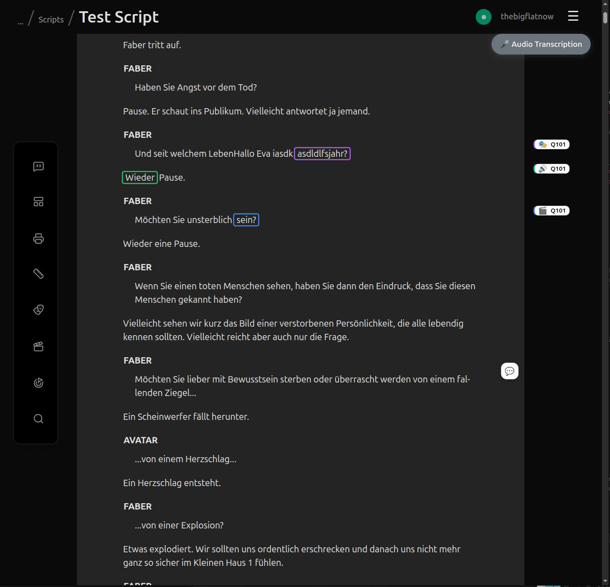
   
  Main editor with collaboration, speaker tools, cues, and toolbar.
    

<table>
  <tr>
    <td align="center" valign="top">
      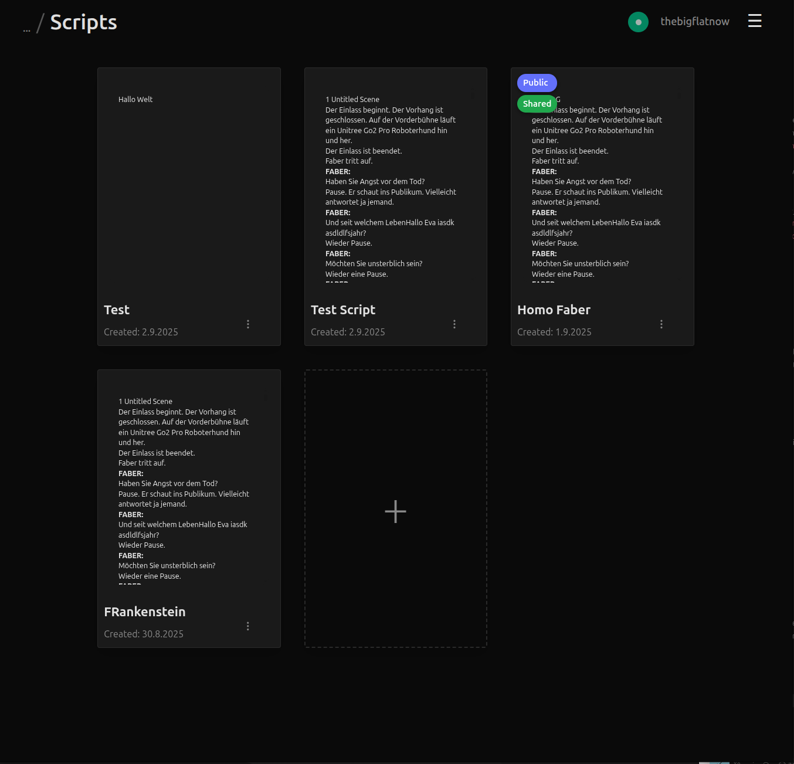
       Scripts overview with thumbnails and sharing badges.
    </td>
    <td align="center" valign="top">
      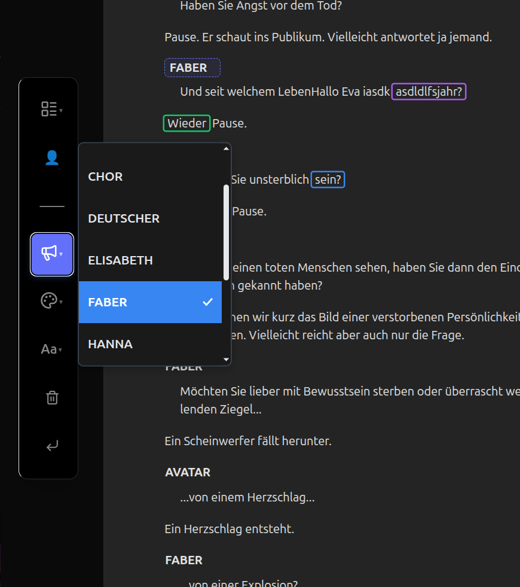
       Speaker selection and role styling.
    </td>
  </tr>
  <tr>
    <td align="center" valign="top">
      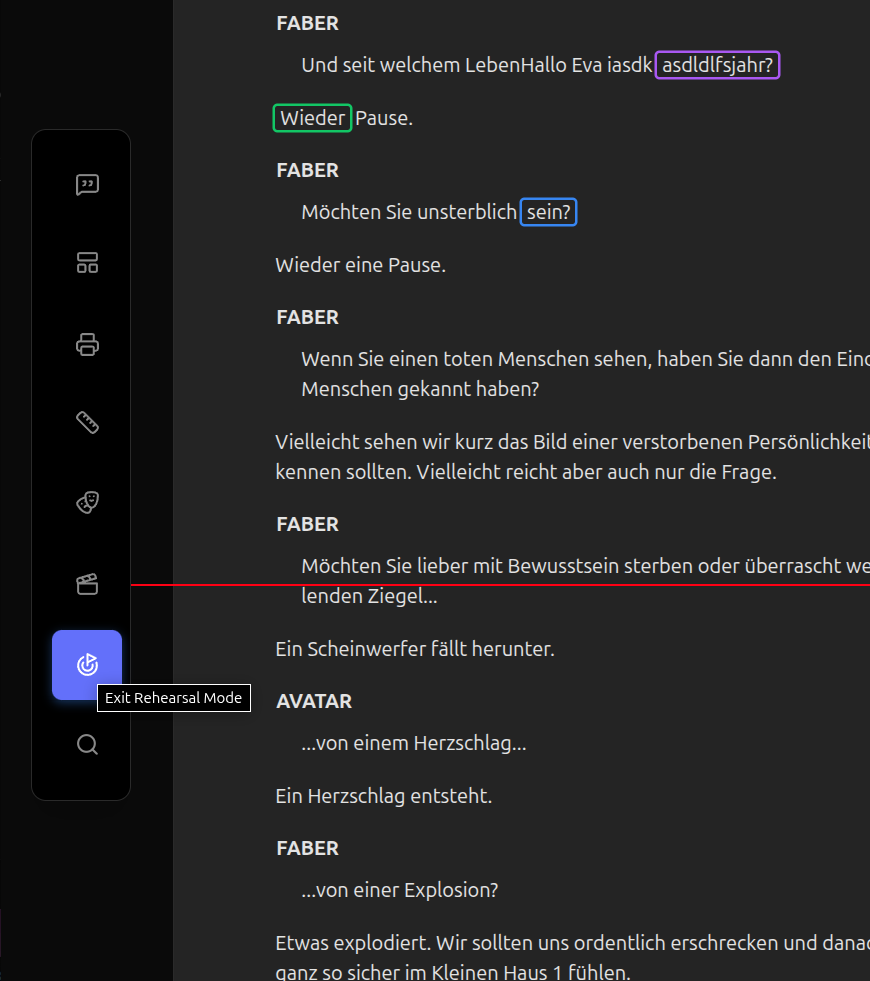
       Rehearsal mode with synced focus line (awareness).
    </td>
    <td align="center" valign="top">
      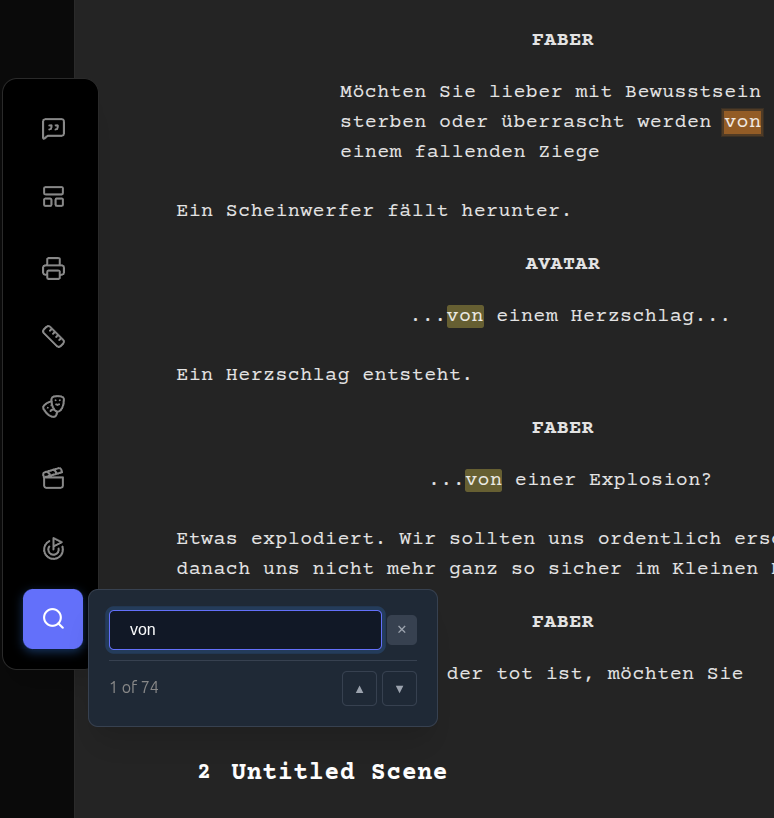
       Inline search with highlight and navigation.
    </td>
  </tr>
  <tr>
    <td align="center" valign="top">
      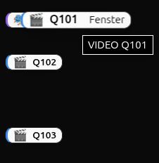
       Cue badges and quick references.
    </td>
    <td align="center" valign="top">
      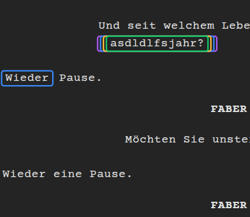
       Word highlight and cue connections.
    </td>
  </tr>
  <tr>
    <td align="center" valign="top">
      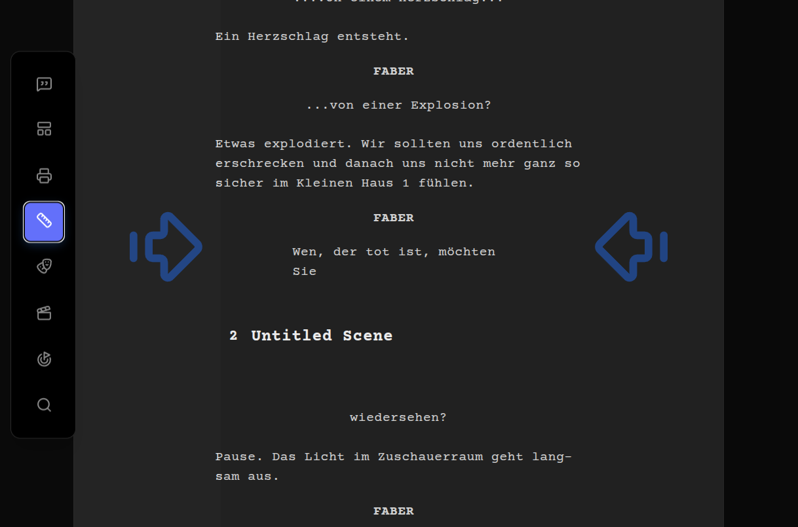
       Navigation markers and layout arrows.
    </td>
    <td align="center" valign="top">
      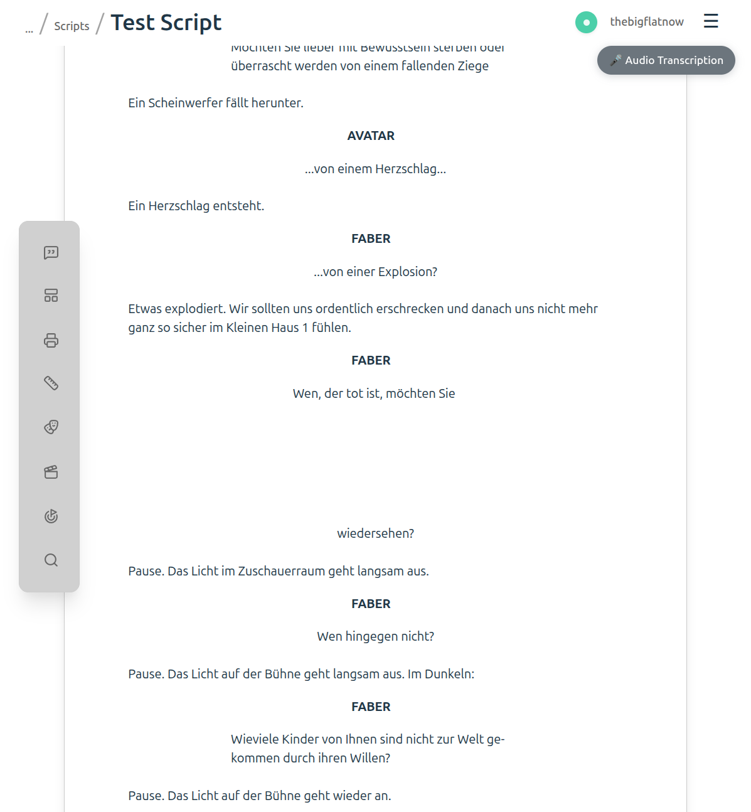
       Light page preview style.
    </td>
  </tr>
  <tr>
    <td align="center" valign="top">
      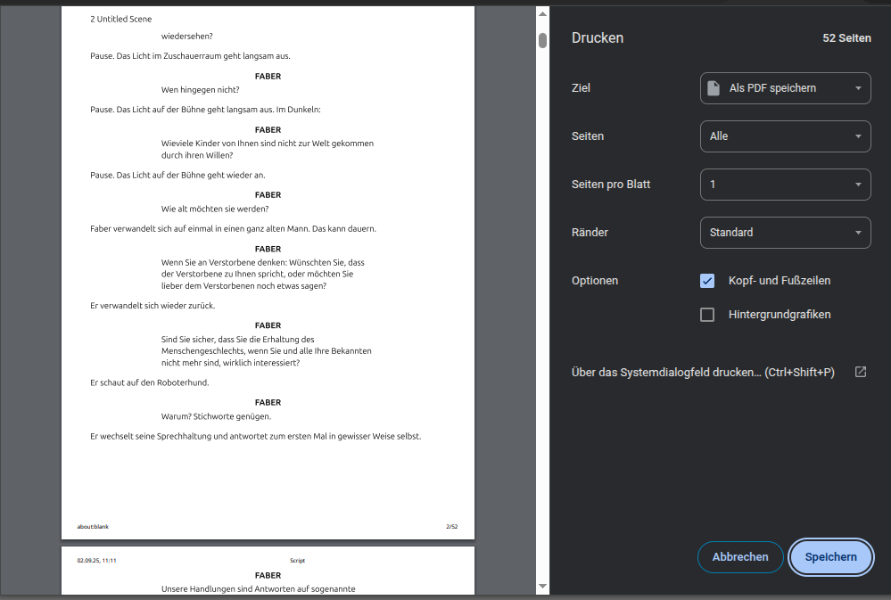
       Print to PDF with clean script formatting.
    </td>
    <td align="center" valign="top">
      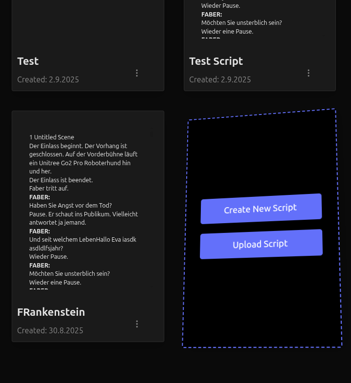
       Create new or upload script workflow.
    </td>
  </tr>
</table>

Product Tour

Scripts Overview
The dashboard presents scripts as cards with thumbnails, visibility badges, and quick actions. Use it to create a new script or upload a PDF for parsing. Public scripts are marked and shared scripts are highlighted for clarity.

Collaborative Editor
The editor is built for rehearsal and production: speaker labels, cue blocks, and a clean page layout. Collaboration runs over Yjs with a WebSocket provider; awareness shows cursors and a shared rehearsal line.

Roles & Styling
Pick speakers quickly and apply role‑aware formatting. Font size/style and dialogue layout controls live in a focused toolbar that appears contextually.

Rehearsal Mode
Lock attention with a synchronized rehearsal line. The position travels via awareness so everyone stays in the same spot during a run‑through.

Search & Navigation
Search highlights all matches inline and provides next/previous jumps. Large scripts remain snappy thanks to virtualized rendering and Yjs updates.

Cues & Word Connections
Attach cues and connect them to words or phrases. Badges provide quick reference in the margin; hovering reveals precise anchors.

 

Layout & Pagination
Switch between single‑page and paginated views. Navigation arrows make it easy to step through long scenes with consistent rhythm on stage.

Light Mode & Print
Preview in a clean light mode and print to PDF with production‑ready formatting. The print stylesheet removes UI chrome and optimizes spacing/typography.

 

Create & Upload
Start from a blank script or upload a PDF. The backend splits the PDF and orchestrates parsing so you can begin rehearsing quickly.

Architecture
- Backend (Rust/Axum): `backend/`
  - HTTP + WebSocket server, JWT auth (httpOnly cookies), CSRF token endpoint, strict CORS, security headers.
  - PostgreSQL via SQLx; migrations run on start; admin bootstrap password fixer.
  - Yjs storage strategy: recent updates table plus on-demand compaction, binary Yjs state export.
  - Services: script CRUD, sharing/public toggle, thumbnails, session monitoring, PDF import orchestration hooks.
- Frontend (React/Vite/TipTap): `frontend/`
  - Script list with thumbnails and sharing badges, upload flow, background upload overlay.
  - Collaborative editor using Yjs + WebSocket provider; presence/awareness and rehearsal line sync.
  - Rich toolbar: speaker tools, cue types, font size/style, layout presets, view modes (single/multi page), search.
  - Print styles for clean PDF export (via browser print dialog).
  - PWA setup (production build), Capacitor config for Android build.

Key Endpoints (Backend)
- Health: `GET /health`
- Auth:
  - `POST /register`, `POST /login`, `POST /logout`
  - `GET /api/me` (user), `GET /api/csrf-token` (CSRF), `GET /api/ws-token` (JWT for WS)
- Scripts CRUD (JSON, Auth required):
  - `GET /api/scripts` — list
  - `POST /api/scripts` — create `{ title }`
  - `GET /api/scripts/:id` — script + base64 Yjs state
  - `PATCH /api/scripts/:id` — rename `{ title }`
  - `DELETE /api/scripts/:id` — delete
- Yjs/Realtime:
  - `GET /api/scripts/:id/yjs` — binary Yjs state update (octet‑stream)
  - `GET /api/scripts/:id/updates?since=ID` — recent updates
  - `POST /api/scripts/:id/compact` — trigger compaction (manual)
  - WebSocket: `GET /api/collab/:script_id` — Yjs sync; access control checks (owner/public/shared).
- Sharing/Visibility:
  - `POST /api/s/:script_id/share` — share with `{ username, permission }`
  - `GET /api/s/:script_id/shares` — list shares with usernames
  - `DELETE /api/s/:script_id/shares/:share_id` — revoke
  - `PATCH /api/s/:script_id/public` — toggle public
- Upload/Parsing (PDF):
  - `POST /api/s/upload-pdf` — multipart upload (50MB limit), PDF split & parse pipeline
  - `POST /api/s/parse-pdf/*path` — parse existing file path (dev)

Security Highlights
- httpOnly cookies for auth; CORS allows origins listed in `ALLOWED_ORIGINS`.
- CSP/HSTS/X‑Frame‑Options/Referrer‑Policy/Permissions‑Policy controlled via env in backend.
- Rate limiting middleware guards expensive routes (upload/thumbnail generation).
- WS access control verifies ownership/public/share on upgrade.

Local Development
- Compose: `docker compose --env-file .env.dev -f docker-compose.dev.yml up -d`
  - Services: `db`, `backend`, `frontend`, `pgadmin` (admin UI). If you prefer no PgAdmin, start only needed services: `up -d db backend frontend`.
- Dev script: `./scripts_deploy/deploy.local.sh`
  - Builds images, brings the stack up, verifies health, prints access URLs:
    - Frontend: `https://localhost:8080` (self‑signed cert)
    - Backend: `http://localhost:3000`
    - PgAdmin: `http://localhost:5050` (if enabled)
- Frontend direct (optional):
  - `cd frontend && npm i`
  - Dev server: `npm run dev` (HTTPS proxy to backend, WS proxy for collab)
  - Build: `npm run build` → static assets served by Caddy in prod image

Environment Variables (essentials)
- Backend (.env.dev): `DATABASE_URL`, `POSTGRES_USER`, `POSTGRES_PASSWORD`, `POSTGRES_DB`, `BACKEND_PORT=3000`, `ALLOWED_ORIGINS`, `JWT_SECRET`, admin bootstrap vars: `ADMIN_EMAIL`, `ADMIN_PASSWORD`, `ADMIN_PLACEHOLDER_HASH`.
- Frontend: `VITE_API_BASE_URL`, `VITE_WS_BASE_URL`, `VITE_GOOGLE_CLIENT_ID`.
- Compose binds volumes for cargo caches, uploads, and PG data.

Database & Data Reset
- Full Docker reset (dangerous):
  - Stop/remove containers, images, volumes, builder cache.
  - Example: `docker system prune -a --volumes -f && docker builder prune -a -f`.
- Project‑scoped: remove only the named volumes from `docker-compose.dev.yml` (e.g., `${CONTAINER_PREFIX:-dev_}postgres_data`, `${CONTAINER_PREFIX:-dev_}pgadmin_data`).

Android (optional)
- Production build and Capacitor packaging scripts under `scripts_deploy/` and `android/`.
- Example: `cd frontend && npm run android:build` (see scripts for details).

Troubleshooting
- CORS/auth: Ensure you access the app through the configured domain/port listed in `ALLOWED_ORIGINS`.
- WS not connecting: Check `GET /api/ws-token` works and that `VITE_WS_BASE_URL` points to the backend host/port.
- PG data persistence: Named volume `postgres_data`. Remove it to start fresh.
- Large PDFs: Upload endpoint limited to 50MB. Split happens in container via `/app/split_pdf.sh`.

Repository Map
- `backend/` — Rust backend (Axum, SQLx, Yjs persistence, WS, auth, services)
- `frontend/` — React + Vite app (TipTap editor, scripts UI)
- `docker-compose.dev.yml` — Local dev stack
- `docker-compose.prod.yml` — Production stack
- `scripts_deploy/` — Dev/prod deploy scripts and Android helpers
- `docs/screenshots/` — Documentation screenshots (add your PNGs here)

PgAdmin In Dev
- Compose includes a `pgadmin` service. To omit it:
  - One‑off: `docker compose --env-file .env.dev -f docker-compose.dev.yml up -d db backend frontend`
  - Permanent: comment/remove the `pgadmin:` service block, or use Compose profiles to enable it only when requested.

License
- AGPL-3.0-or-later (see LICENSE).
- For commercial licensing (to keep modifications private or embed without AGPL obligations), contact the maintainer.
