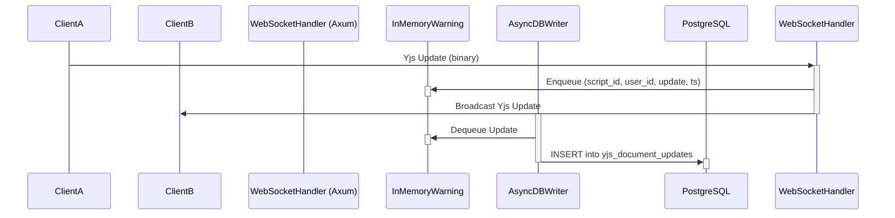
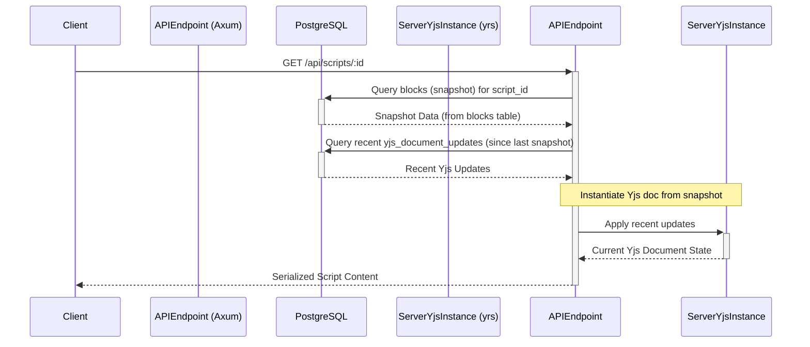
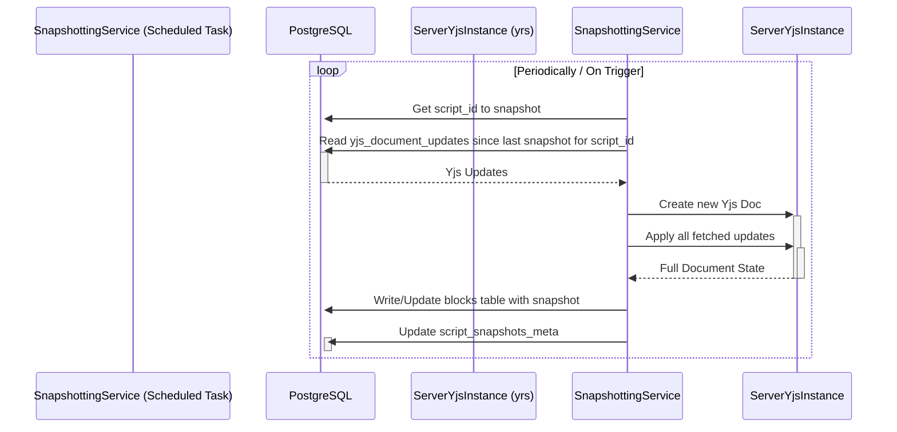

# Yjs Persistence Strategy: Backend Asynchronous Writes & Snapshotting

## 1. Overview

This document outlines a robust strategy for persisting Yjs-driven collaborative script edits to a PostgreSQL database in the Pessoa application. The primary goals are to support high concurrency (e.g., 100+ simultaneous users per script), maintain a full granular history of changes, and ensure high performance for real-time interactions.

The core idea is to decouple the real-time WebSocket message handling from direct, synchronous database writes. Instead, Yjs updates are queued and processed asynchronously by a dedicated backend service. Periodic snapshotting of the full document state ensures efficient script loading.

## 2. Key Components

### 2.1. WebSocket Handler (Axum - `backend/src/ws.rs`)
- **Current Role:** Relays Yjs messages between connected clients.
- **New Responsibilities:**
    - Upon receiving a Yjs binary update from a client:
        1.  [x] Validate the update (optional, basic sanity checks). (Assumed basic validation exists or is implicitly handled by Yjs binary format)
        2.  [x] Push the binary update (along with `script_id`, `user_id`, and `timestamp`) into an In-Memory Queue.
        3.  [x] Continue to broadcast the update to other connected clients in the same script room as current.
- **Technology:** Axum, Tokio. **[x] Implemented**

### 2.2. In-Memory Queue
- **Purpose:** Acts as a buffer between the high-throughput WebSocket handler and the database writer. Prevents database operations from blocking real-time message relay.
- **Implementation Options:**
    - [x] **Tokio MPSC Channel:** Simple, efficient for single-process backend. (Chosen and implemented)
    - [ ] **Redis List:** More robust, allows for potential future scaling to multiple backend instances (though this adds an external dependency). For the current setup, a Tokio channel is likely sufficient.
- **Message Format:** `(script_id: Uuid, user_id: Uuid, update_data: Vec<u8>, timestamp: DateTime<Utc>)`. **[x] Implemented as `YjsPersistenceEvent`**

### 2.3. Asynchronous Database Writer Service
- **Purpose:** Consumes Yjs updates from the In-Memory Queue and persists them to the database.
- **Implementation:**
    - [x] A separate Tokio task (or a pool of tasks) running in the backend.
    - [x] Loops indefinitely, dequeuing messages.
    - [ ] Batches updates (e.g., collect N updates or process for X milliseconds) before writing to PostgreSQL to reduce transaction overhead (optional optimization). (Currently writes one by one)
    - [x] Writes to a new `yjs_document_updates` table.
- **Error Handling:**
    - [~] Implement retry mechanisms for transient database errors, and robust logging for persistent failures. (Basic logging exists, retry/DLQ is TODO)
    - [ ] Consider a dead-letter queue for updates that consistently fail. (TODO in code comments)
- **Technology:** Tokio, SQLx. **[x] Implemented**

### 2.4. Snapshotting Service
- **Purpose:** Periodically creates a full snapshot of a script's Yjs document state and saves it to the primary `blocks` table (or a dedicated snapshots table). This optimizes script loading times, as clients don't need to replay an excessive number of small updates.
- **Implementation:**
    - [x] A scheduled Tokio task (e.g., runs every few minutes per active script, or after a certain number of updates).
    - For a given `script_id`:
        1.  [x] Fetch all Yjs updates from `yjs_document_updates` since the last snapshot (or all, if no snapshot exists).
        2.  [x] Instantiate a server-side Yjs document (`yrs::Doc`). Document size (e.g., 100 pages) is generally manageable for `yrs` but server resources (CPU/memory) for this process should be monitored.
        3.  [x] Apply all fetched updates to this document.
        4.  [ ] Serialize the relevant content from the Yjs document into the format expected by the `blocks` table. **Following Option A (Granular):** This service will need logic to traverse the `yrs::Doc` structure (e.g., an XML fragment if Tiptap is used) and identify segments that correspond to your `block_type` definitions (e.g., 'dialogue', 'stage_direction'). Each identified segment's content will be extracted. This mapping is the most complex part of this service. (**CRITICAL TODO: Marked as NOT YET IMPLEMENTED in code**)
        5.  [ ] Store/Update this content by creating/updating multiple rows in the `blocks` table, reflecting the granular structure. (**CRITICAL TODO: Dependent on step 4**)
        6.  [x] Record the timestamp or the ID of the last processed update in a `script_snapshots_meta` metadata table.
- **Triggering:** [x] Can be time-based, update-count-based, or triggered when a script room becomes inactive. (Logic exists in `get_scripts_needing_snapshot`)
- **Technology:** Tokio, SQLx, `yrs` crate. **[~] Partially Implemented (core serialization/writing to blocks missing)**

### 2.5. Database Schema Changes

#### 2.5.1. New Table: `yjs_document_updates`
- **Purpose:** Stores individual Yjs binary updates for full history.
- **Columns:**
    - `id: BIGSERIAL PK` (or `UUID PK` if preferred, but `BIGSERIAL` might be better for high-volume inserts and ordering) **[x] Implemented as BIGSERIAL**
    - `script_id: UUID FK to scripts.id` **[x] Implemented**
    - `user_id: UUID FK to users.id` (nullable if updates can be system-generated) **[x] Implemented**
    - `update_data: BYTEA` (stores the Yjs binary diff) **[x] Implemented**
    - `created_at: TIMESTAMPTZ DEFAULT CURRENT_TIMESTAMP` **[x] Implemented**
- **Indexes:**
    - `(script_id, created_at)` or `(script_id, id)` for efficient retrieval of updates for a script. **[x] Implemented `(script_id, created_at)`**

#### 2.5.2. New Table: `script_snapshots_meta` (Optional, but Recommended)
- **Purpose:** Tracks the last successful snapshot for each script.
- **Columns:**
    - `script_id: UUID PK FK to scripts.id` **[x] Implemented**
    - `last_snapshot_at: TIMESTAMPTZ` **[x] Implemented**
    - `last_processed_update_id: BIGINT` (FK to `yjs_document_updates.id`) or `last_processed_update_timestamp: TIMESTAMPTZ` **[x] Implemented as `last_processed_update_id: BIGINT`**
- **Indexes:** `(script_id)` **[x] Implemented (PK serves as index)**

#### 2.5.3. Considerations for `blocks` Table
- The `blocks` table would now primarily store the **snapshotted state** of the script content derived from Yjs, represented as individual, typed blocks. **[ ] To Do (as snapshot writing to blocks is not complete)**
- How the Yjs document (which can be a complex structure, especially with rich text editors like Tiptap) maps to rows in the `blocks` table is a critical design decision.
    - **Chosen Approach: Option A (Granular):** The Snapshotting Service will attempt to parse the Yjs document (e.g., iterate through nodes in a `Y.XmlFragment` if used by Tiptap) and identify distinct elements that correspond to your `block_type` schema. For each such element, its content will be extracted and stored as a separate row in the `blocks` table.
        - **Implications:** This allows direct SQL querying and AI processing on granular blocks as currently designed. However, it significantly increases the complexity of the Snapshotting Service. The logic to reliably identify block boundaries and types from the Yjs document structure (which might be nested or very flexible) must be robust. Changes to the Tiptap schema or Yjs data structure on the frontend could require updates to this backend mapping logic on the backend. **[ ] To Do (Core logic missing)**
    - **Alternative (Option B - Monolithic - Not Chosen):** Store the entire script content (derived from the Yjs snapshot) as a single "document block" or a structured JSON within one or a few block rows associated with the script. This simplifies snapshotting but might require changes to how the frontend and other systems consume block data.
- The `edits` table might become redundant for fine-grained history if `yjs_document_updates` serves that purpose. It could be repurposed for manual versioning or high-level change logging. **[ ] To Do (Decision pending full Yjs history implementation and review)**

## 3. Data Flow Diagrams

### 3.1. Real-time Yjs Update Propagation & Persistence

### 3.2. Script Loading (Optimized with Snapshots)

*(Initial load might also involve client-side application of updates if only raw updates are sent for very recent changes not yet in a snapshot)*

### 3.3. Snapshotting Process

## 4. History Reconstruction

- To view the state of a script at a specific point in time `T`:
    1. Find the latest snapshot in `script_snapshots_meta` created *before or at* `T`.
    2. Load this snapshot into a server-side `yrs::Doc`.
    3. Fetch Yjs updates from `yjs_document_updates` for that `script_id` that occurred *after* the snapshot's timestamp but *before or at* `T`.
    4. Apply these updates sequentially to the `yrs::Doc`.
    5. The resulting document state is the historical view.
- This allows for full, granular playback of changes.

## 5. Advantages & Disadvantages

### 5.1. Advantages
- **High Performance for Real-time:** WebSocket interactions remain fast, not blocked by DB writes.
- **Full Granular History:** All Yjs updates are stored, enabling detailed audit and playback.
- **Improved Scalability:** Backend can handle more concurrent users and updates due to asynchronous processing.
- **Resilience:** Updates are queued on the backend, reducing data loss risk if a client disconnects prematurely before a batched REST save.
- **Efficient Script Loading:** Snapshots prevent clients from needing to apply an excessive number of historical updates.

### 5.2. Disadvantages
- **Increased Complexity:** More backend components and logic to develop and maintain (queue, writer service, snapshotting service, server-side Yjs document management).
- **Potential Eventual Consistency:** There might be a very short delay between a user making an edit and that edit being permanently persisted in `yjs_document_updates`. Snapshots are also point-in-time. This is usually acceptable for collaborative apps.
- **Resource Usage:** Server-side Yjs document processing for snapshots will consume CPU and memory.
- **Schema Mapping Challenge:** Mapping complex Yjs document structures to the existing relational `blocks` schema for snapshotting needs careful design.

## 6. Key Technologies & Rust Crates

- **Rust & Tokio:** For all asynchronous backend services.
- **Axum:** For the WebSocket handler.
- **SQLx:** For database interaction.
- **`yrs`:** Rust port of Yjs. Essential for server-side Yjs document instantiation, applying updates, and serializing for snapshots.
- **Tokio MPSC Channels:** For the in-memory queue (if not using Redis).
- **Serde:** For serializing/deserializing messages if needed.

## 7. Impact on Existing System

- **`backend/src/ws.rs`:** [x] Needs modification to push to queue. (Now sends to `persistence_event_tx`)
- **New Backend Services:** [x] Writer, Snapshotter need to be created. (Writer is mostly complete, Snapshotter is partially complete and spawned)
- **Database:** [x] Schema changes (new tables `yjs_document_updates`, `script_snapshots_meta` implemented).
- **`blocks` Table:** [ ] Role might shift to storing snapshots; content structure for snapshots needs definition. (Shift not yet occurred as snapshot writing to blocks is incomplete)
- **REST API for Blocks (`PATCH /api/blocks/:id`):**
    - [ ] If this endpoint is still used for "manual saves" by clients, it would need to reconcile its changes with the Yjs model. This could be complex. (Currently not reconciled)
    - [ ] Ideally, all content modifications for collaborative scripts go through the Yjs WebSocket flow. Non-collaborative edits or metadata changes might still use REST. (Ideal state, not yet enforced)
- **Frontend:**
    - [x] Largely unaffected for the real-time editing experience if the Yjs sync protocol (`y-websocket`) remains the primary interface.
    - [ ] Script loading logic might change slightly if the backend provides an initial state derived from a snapshot + recent Yjs updates. (Likely no change yet, as backend cannot fully provide this granular snapshot data yet)

## 8. Action Plan & Key Design Decisions

This section converts previous open questions into a clearer action plan and set of design decisions for implementation.

- **Snapshotting Strategy & Document Size Handling:**
    - **Frequency & Triggers:** [~] Initial snapshotting will be triggered based on activity. (Basic logic exists in `get_scripts_needing_snapshot`, configuration exposure/tuning TBD)
    - **Large Document Management (e.g., 100+ pages):** [~] The `yrs` crate is capable of handling such document sizes. The Snapshotting Service's resource consumption (CPU, memory during `yrs::Doc` processing and serialization) will be benchmarked and monitored. If performance issues arise with very large documents, optimizations to the snapshotting process (e.g., more incremental processing if feasible with the granular approach, or offloading to a separate less critical task queue) will be investigated. (`spawn_blocking` used, full benchmarking TBD)

- **Mapping Yjs to `blocks` (Granular Approach - Option A):**
    - **Core Task:** [ ] A primary development task is to create a robust mapping layer within the Snapshotting Service. This layer will parse the server-side `yrs::Doc` (which likely reflects the Tiptap/ProseMirror schema, often stored in a `Y.XmlFragment`). (**CRITICAL TODO**)
    - **Mapping Logic:** [ ] The logic will identify node types and attributes within the Yjs document that correspond to the defined `block_type`s (e.g., 'dialogue', 'stage_direction', 'character') and their respective `content`. This requires detailed analysis of the frontend editor's Yjs data structure. (**CRITICAL TODO**)
    - **Maintenance:** [ ] Changes or evolutions in the frontend Tiptap schema that affect Yjs structure will necessitate corresponding updates to this backend mapping logic. (Dependent on implementation)

- **Conflict Resolution during Snapshotting (Yjs Intrinsic Handling):**
    - **Design Principle:** [x] Conflict resolution is inherently managed by Yjs CRDT algorithms. The system will ensure that Yjs updates are queued and applied to the server-side `yrs::Doc` by the Snapshotting Service in a consistent, ordered manner (based on `created_at` from `yjs_document_updates`). No additional, custom conflict resolution logic is required within the snapshotting process itself.

- **Error Handling & Monitoring:**
    - **Logging:** [x] Comprehensive structured logging using the `tracing` crate will be implemented for all new services (AsyncDBWriter, SnapshottingService). Logs will cover queue operations, database interactions, snapshot creation, Yjs document processing, and all error conditions.
    - **Initial Monitoring:** [x] Relies on detailed analysis of these logs. `pgAdmin` will be used for direct database state verification.
    - **Dead-Letter Handling:** [ ] For Yjs updates that persistently fail processing in the AsyncDBWriter (after defined retries), a mechanism will be implemented to move them to a separate log or table for manual inspection, preventing them from blocking the main queue. (TODO in code comments)
    - **Future Enhancement:** [ ] Integration with dedicated monitoring tools (e.g., Prometheus, Grafana) for metrics and alerting will be considered as a future scalability and operational improvement.

- **Archival/Pruning of `yjs_document_updates`:**
    - **Policy:** [ ] A background task will be implemented to prune (delete) records from the `yjs_document_updates` table that are older than or contemporaneous with the `last_processed_update_id` recorded in the `script_snapshots_meta` table for each script. This ensures that only updates more recent than the latest snapshot are retained for active processing, while historical details covered by snapshots are removed to manage storage growth. (TODO in code comments)

- **Initial Data Seeding (for Existing Scripts):**
    - **Requirement:** [ ] If existing script data (currently in the `blocks` table) needs to be integrated into this Yjs-based system, a one-time migration script is required.
    - **Process:** [ ] This script will:
        1.  Read the existing structured blocks for each script from PostgreSQL.
        2.  Construct a `yrs::Doc` instance on the server that accurately represents this script content according to the defined Yjs/Tiptap schema.
        3.  Save an initial full snapshot of this `yrs::Doc` to the `blocks` table (using the granular approach).
        4.  Record this initial snapshot in the `script_snapshots_meta` table.
        5.  Optionally, generate a single Yjs update representing the creation of the entire document from this initial state and store it in `yjs_document_updates` to signify the document\'s origin in the Yjs history.

This strategy provides a solid foundation for a scalable and historically accurate collaborative editing experience. 