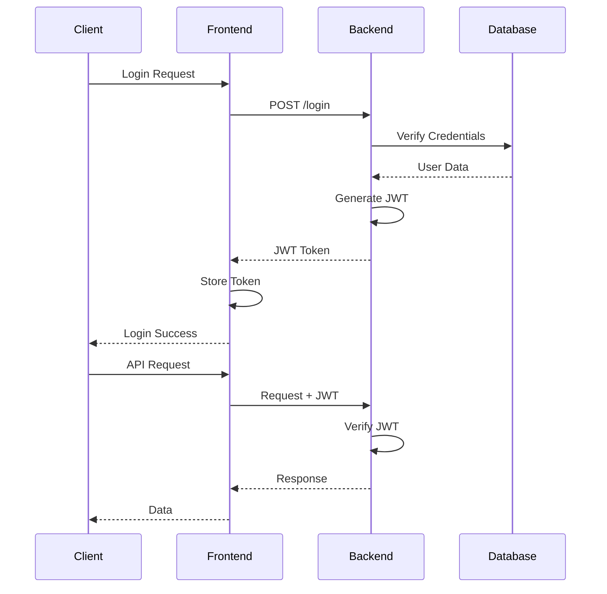
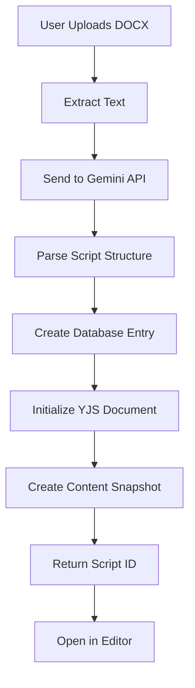
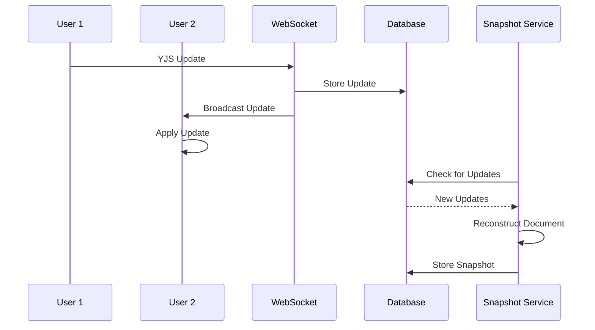

# 🏗️ Pessoa Architecture Guide

Complete technical architecture documentation for the Pessoa theater collaboration platform.

## 📋 Table of Contents

1. [System Overview](#-system-overview)
2. [Frontend Architecture](#-frontend-architecture)
3. [Backend Architecture](#-backend-architecture)
4. [Real-time Collaboration](#-real-time-collaboration)
5. [AI Integration](#-ai-integration)
6. [Database Design](#-database-design)
7. [Deployment Architecture](#-deployment-architecture)
8. [Security Architecture](#-security-architecture)
9. [Performance Architecture](#-performance-architecture)

## 🎯 System Overview

Pessoa is a modern real-time collaborative scriptwriting platform built for professional theater production. It combines document editing, AI-powered script analysis, and real-time collaboration in a mobile-first, production-ready system.

### 🔧 Technology Stack

| Component | Technology | Purpose |
|-----------|------------|---------|
| **Frontend** | React + TypeScript + TipTap | Modern editor with real-time collaboration |
| **Backend** | Rust + Axum + PostgreSQL | High-performance API and data persistence |
| **Real-time** | YJS + WebSockets | Conflict-free collaborative editing |
| **AI Analysis** | Google Gemini API | Script analysis and content extraction |
| **Infrastructure** | Docker + Nginx | Container orchestration and reverse proxy |

### 📊 High-Level Architecture

```
┌─────────────────────────────────────────────────────────────────┐
│                        CLIENT LAYER                             │
├─────────────────────────────────────────────────────────────────┤
│  React Frontend (Port 8080/8443)                                │
│  ├─ TipTap Editor (Collaborative Editing)                       │
│  ├─ YJS Provider (Real-time Sync)                               │
│  └─ WebSocket Client (Live Collaboration)                       │
└─────────────────────────────────────────────────────────────────┘
                                │
                                ▼
┌─────────────────────────────────────────────────────────────────┐
│                      REVERSE PROXY                              │
├─────────────────────────────────────────────────────────────────┤
│  Nginx (HTTPS Termination, Static Files)                        │
│  ├─ SSL/TLS Configuration                                       │
│  ├─ Static Asset Serving                                        │
│  └─ Request Routing                                             │
└─────────────────────────────────────────────────────────────────┘
                                │
                                ▼
┌─────────────────────────────────────────────────────────────────┐
│                      BACKEND LAYER                              │
├─────────────────────────────────────────────────────────────────┤
│  Rust Backend (Port 3001)                                       │
│  ├─ Axum Web Framework                                          │
│  ├─ WebSocket Handler (Real-time)                               │
│  ├─ REST API (CRUD Operations)                                  │
│  ├─ Authentication (JWT)                                        │
│  └─ Service Manager (Background Tasks)                          │
└─────────────────────────────────────────────────────────────────┘
                                │
                                ▼
┌─────────────────────────────────────────────────────────────────┐
│                    PERSISTENCE LAYER                            │
├─────────────────────────────────────────────────────────────────┤
│  PostgreSQL Database (Port 5432)                                │
│  ├─ Script Content & Metadata                                   │
│  ├─ User Management                                             │
│  ├─ Real-time Updates (YJS)                                     │
│  └─ Content Snapshots                                           │
└─────────────────────────────────────────────────────────────────┘
                                │
                                ▼
┌─────────────────────────────────────────────────────────────────┐
│                      AI SERVICES                                │
├─────────────────────────────────────────────────────────────────┤
│  Google Gemini API                                              │
│  ├─ Script Analysis                                             │
│  ├─ Content Extraction                                          │
│  └─ Structure Detection                                         │
└─────────────────────────────────────────────────────────────────┘
```

## 🎨 Frontend Architecture

### 🏗️ Component Structure

```
frontend/src/
├── components/
│   ├── editor/                    # 🎭 Editor System
│   │   ├── components/
│   │   │   ├── Editor.tsx         # Main editor orchestrator
│   │   │   ├── page/PageCanvas.tsx # DIN A4 page container
│   │   │   └── toolbar/Toolbar.tsx # Context-aware toolbar
│   │   ├── hooks/
│   │   │   ├── useEditorCore.ts   # TipTap + YJS integration
│   │   │   ├── useResponsiveDesign.ts # Mobile-first design
│   │   │   └── useYjsConnection.ts # Real-time sync
│   │   ├── extensions/            # TipTap extensions
│   │   │   ├── DialogueBlock.ts   # Dialogue structure
│   │   │   └── Speaker.ts         # Speaker management
│   │   └── styles/                # Modern CSS architecture
│   │       ├── variables.css      # Design tokens
│   │       └── responsive.css     # Mobile-first styles
│   ├── Auth/                      # 🔐 Authentication
│   │   ├── Login.tsx
│   │   └── Register.tsx
│   └── ScriptList.tsx             # 📋 Script management
├── api.ts                         # 🔗 Backend communication
├── AuthContext.tsx                # 🔐 Global auth state
└── types.ts                       # 📝 TypeScript definitions
```

### 🎯 Key Features

#### 📱 Mobile-First Design
- **Responsive toolbar**: Bottom position on mobile, floating on desktop
- **DIN A4 scaling**: Maintains script format across all device sizes
- **Touch optimization**: 44px minimum touch targets

#### 🎨 Context-Aware UI
- **Default context**: View controls, page management
- **Text selection**: Formatting controls (bold, italic, alignment)
- **Dialogue blocks**: Layout switching, speaker management
- **Empty pages**: Content insertion tools

#### ⚡ Performance Optimizations
- **Lazy loading**: Components load on demand
- **Bundle splitting**: Optimized for fast loading
- **Debounced saves**: Efficient server communication

### 🔧 Editor Architecture

The editor is built around TipTap (ProseMirror) with YJS for real-time collaboration:

```typescript
// Editor initialization with YJS
const { editor, ydoc, provider } = useEditorCore({
  scriptId,
  user,
  hasToken: !!token,
});

// Real-time document sync
const ydoc = new Y.Doc();
const provider = new WebsocketProvider(
  `wss://your-domain.com/api/collab/${scriptId}`,
  scriptId,
  ydoc,
  { params: { token } }
);

// TipTap integration
const editor = useEditor({
  extensions: [
    StarterKit,
    Collaboration.configure({ document: ydoc }),
    CollaborationCursor.configure({ provider }),
    // Custom extensions for dialogue, speakers, etc.
  ],
});
```

## 🛠️ Backend Architecture

### 🏗️ Current Architecture Issues

**⚠️ CRITICAL: The backend currently suffers from major architectural violations that require immediate refactoring:**

```rust
// PROBLEM: 719-line main.rs god object (src/main.rs)
// Contains: endpoints, config, middleware, main logic - violates SRP
async fn main() -> Result<()> {
    // ... 700+ lines of mixed concerns
}

// PROBLEM: 1071-line lib.rs MEGA god object (src/lib.rs)  
// Contains: database ops, HTML parsing, AI integration, layouts
pub async fn create_script_from_parsed_with_pages(/* 188 lines */) -> Result<Uuid> {
    // ... massive function spanning multiple abstraction levels
}

// PROBLEM: Mixed concerns in auth.rs (444 lines)
// Contains: auth + rate limiting + validation - should be separated
pub struct RateLimiter { /* rate limiting mixed with auth */ }
```

### 🚨 Critical Security Issues

```rust
// CRITICAL VULNERABILITY: Weak password validation (auth.rs:35)
static ref PASSWORD_REGEX: Regex = Regex::new(r"^.{8,}$")
    .expect("PASSWORD_REGEX compilation failed");
// ☠️ Only checks length >=8, allows "12345678" despite comments claiming complexity
```

### ✅ Well-Implemented Components

**ServiceManager is actually EXCELLENT** - this shows the team can write clean code:

```rust
// ✅ GOOD: ServiceManager (259 lines) - Proper dependency injection
pub struct ServiceManager {
    pub database_pool: Arc<PgPool>,
    pub rate_limiter: Arc<RateLimiter>,
    pub persistence_tx: mpsc::Sender<YjsPersistenceEvent>,
    service_handles: Vec<JoinHandle<()>>,
}

impl ServiceManager {
    // ✅ Proper dependency injection and service initialization
    pub async fn new(pool: PgPool, rate_limit_window: Duration, rate_limit_max: usize) -> Result<Self>
    
    // ✅ Graceful shutdown with proper cleanup
    pub async fn shutdown(self) -> Result<()>
    
    // ✅ Comprehensive health checks
    pub async fn health_check(&self) -> ServiceHealthStatus
    
    // ✅ Clean getter methods for dependency injection
    pub fn get_database_pool(&self) -> PgPool
    pub fn get_rate_limiter(&self) -> Arc<RateLimiter>
    pub fn get_persistence_sender(&self) -> mpsc::Sender<YjsPersistenceEvent>
}
```

### 🎯 Refactoring Strategy

**Use ServiceManager as the architectural model:**

```rust
// TODO: Apply ServiceManager patterns to break up god objects
pub mod handlers;     // Extract from main.rs (719 lines → ~50 lines each)
pub mod database;     // Extract from lib.rs database operations
pub mod html_parser;  // Extract from lib.rs HTML parsing utilities  
pub mod ai_service;   // Extract from lib.rs AI integration
pub mod layout_service; // Extract from lib.rs layout management

// TODO: Follow ServiceManager's clean patterns:
// - Single responsibility per module
// - Dependency injection instead of tight coupling
// - Proper error handling with Result<T>
// - Health checks for monitoring
// - Graceful shutdown handling
```

### 🔗 API Architecture

**⚠️ CURRENT ISSUE: All endpoints are embedded in main.rs god object**

```rust
// PROBLEM: 719-line main.rs contains all endpoint handlers inline
// Should be extracted to separate handler modules

// Current bloated structure in main.rs:
async fn register(State(pool): State<Arc<PgPool>>, Json(payload): Json<RegisterPayload>) -> Result<Json<String>, AppError> {
    // ... 25 lines of business logic mixed with HTTP handling
}

async fn login(State(pool): State<Arc<PgPool>>, Json(payload): Json<LoginPayload>) -> Result<Json<String>, AppError> {
    // ... 20 lines of business logic mixed with HTTP handling
}

async fn list_scripts(State(pool): State<Arc<PgPool>>, AuthUser{user_id}: AuthUser) -> Result<Json<ScriptsResponse>, AppError> {
    // ... and 15+ more endpoint handlers in main.rs
}

// TODO: Extract to proper handler modules
Router::new()
    .route("/api/scripts", get(list_scripts).post(create_script))
    .route("/api/scripts/:id", get(get_script).patch(update_script))
    .route("/api/scripts/:id/content", patch(update_content))
    .route("/api/scripts/:id/snapshot", post(store_snapshot))
    
    // WebSocket collaboration
    .route("/api/collab/:script_id", get(websocket_handler))
    
    // Authentication
    .route("/login", post(login))
    .route("/register", post(register))
    
    // Health monitoring
    .route("/health", get(health_check))
```

### 🔐 Authentication & Security

**🚨 CRITICAL SECURITY VULNERABILITY: Weak password validation allows "12345678"**

```rust
// CURRENT BROKEN IMPLEMENTATION (auth.rs:35)
static ref PASSWORD_REGEX: Regex = Regex::new(r"^.{8,}$")
    .expect("PASSWORD_REGEX compilation failed");
// ☠️ Despite comments claiming "complex requirements", only checks length >=8

// PROPER IMPLEMENTATION NEEDED:
static ref PASSWORD_REGEX: Regex = Regex::new(
    r"^(?=.*[a-z])(?=.*[A-Z])(?=.*\d)(?=.*[@$!%*?&])[A-Za-z\d@$!%*?&]{8,}$"
).expect("PASSWORD_REGEX compilation failed");

// JWT-based authentication (working correctly)
pub struct AuthUser {
    pub user_id: Uuid,
    // NOTE: email and role removed from actual implementation
}

// WebSocket authentication (working correctly)
pub struct WsAuthUser {
    pub user_id: Uuid,
    // NOTE: token removed from actual implementation
}

// Rate limiting (PROBLEM: mixed with auth concerns in auth.rs)
pub struct RateLimiter {
    // IP-based rate limiting with configurable windows
    requests: Arc<Mutex<HashMap<String, Vec<Instant>>>>,
    window: Duration,
    max_requests: usize,
}
```

## 🔄 Real-time Collaboration

### 🎯 YJS Integration

Pessoa uses YJS (Y.js) for conflict-free collaborative editing:

```rust
// WebSocket message handling
async fn handle_socket(
    socket: WebSocket,
    script_id: String,
    user_id: String,
    persistence_tx: mpsc::Sender<YjsPersistenceEvent>,
) {
    let mut rx = GLOBAL_BROADCAST.0.subscribe();
    
    loop {
        select! {
            // Handle incoming YJS updates
            Some(msg) = socket_rx.next() => {
                if let Message::Binary(data) = msg {
                    // Check if it's an awareness update (cursor/selection)
                    if !is_awareness_update(&data) {
                        // Persist content updates
                        persistence_tx.send(YjsPersistenceEvent {
                            script_id: script_id.clone(),
                            update_data: data.clone(),
                            user_id: Some(user_id),
                            received_at: Utc::now(),
                        }).await?;
                    }
                    
                    // Broadcast to all connected clients
                    GLOBAL_BROADCAST.0.send((script_id.clone(), user_id.clone(), data))?;
                }
            }
            
            // Handle broadcast messages from other clients
            Ok((broadcast_script_id, sender_user_id, data)) = rx.recv() => {
                if broadcast_script_id == script_id {
                    socket_tx.send(Message::Binary(data)).await?;
                }
            }
        }
    }
}
```

### 📊 Persistence Strategy

#### 🔄 Dual Persistence System

1. **YJS Updates**: Real-time binary updates for collaboration
2. **Content Snapshots**: HTML snapshots for reliability

```rust
// Snapshotting service (runs every 500ms)
pub async fn run_snapshotting_service(
    pool: Arc<PgPool>,
    interval: Duration,
) {
    let mut interval_timer = tokio::time::interval(interval);
    
    loop {
        interval_timer.tick().await;
        
        // Find scripts with unprocessed YJS updates
        let scripts_to_snapshot = get_scripts_needing_snapshots(&pool).await?;
        
        for script_id in scripts_to_snapshot {
            if let Err(e) = create_snapshot_for_script(&pool, script_id).await {
                error!("Failed to create snapshot for script {}: {}", script_id, e);
            }
        }
    }
}
```

#### 🔧 YJS Document Reconstruction

```rust
// Reconstruct YJS document from stored updates
async fn create_snapshot_for_script(
    pool: Arc<PgPool>,
    script_id: Uuid,
) -> Result<(), anyhow::Error> {
    // Get all updates since last snapshot
    let updates = get_yjs_updates_since_last_snapshot(&pool, script_id).await?;
    
    // Create new YJS document
    let doc = Doc::new();
    
    // Bootstrap with expected fragments
    {
        let mut txn = doc.transact_mut();
        for name in ["default", "content", "prosemirror"] {
            txn.get_or_insert_xml_fragment(name);
            txn.get_or_insert_text(name);
        }
    }
    
    // Apply all updates
    {
        let mut txn = doc.transact_mut();
        for update in updates {
            let decoded = Update::decode_v1(&update.update_data)?;
            txn.apply_update(decoded);
        }
    }
    
    // Generate HTML snapshot
    let html_content = extract_html_from_yjs_doc(&doc).await?;
    
    // Store snapshot
    store_content_snapshot(&pool, script_id, &html_content).await?;
    
    Ok(())
}
```

## 🤖 AI Integration

### 🔗 Gemini API Integration

Pessoa uses Google's Gemini API for script analysis:

```rust
// Gemini API client
pub async fn call_gemini_for_parsing(
    http_client: &Client,
    script_text: &str,
) -> Result<ParsedScript, GeminiApiError> {
    let prompt = SCRIPT_ANALYSIS_PROMPT_TEMPLATE.replace("{}", script_text);
    
    let request = GeminiRequest {
        contents: vec![Content {
            parts: vec![Part { text: prompt }],
        }],
        generation_config: Some(GenerationConfig {
            response_mime_type: "application/json".to_string(),
            max_output_tokens: Some(8192),
            response_schema: None, // Flexible JSON parsing
        }),
    };
    
    let response = http_client
        .post(&api_url)
        .query(&[("key", api_key)])
        .json(&request)
        .send()
        .await?;
    
    let parsed: ParsedScript = serde_json::from_str(&response_text)?;
    Ok(parsed)
}
```

### 📝 Script Analysis Pipeline

```rust
// Script upload and analysis flow
pub async fn upload_and_parse_script(
    mut multipart: Multipart,
) -> Result<Json<ParsedScript>, impl IntoResponse> {
    // 1. Extract DOCX file from multipart upload
    let docx_bytes = extract_file_from_multipart(&mut multipart).await?;
    
    // 2. Convert DOCX to plain text
    let plain_text = extract_text_from_docx(&docx_bytes)?;
    
    // 3. Send to Gemini for analysis
    let parsed_script = call_gemini_for_parsing(&http_client, &plain_text).await?;
    
    // 4. Structure script data
    let structured_script = structure_script_data(parsed_script)?;
    
    Ok(Json(structured_script))
}
```

### 🎭 Script Structure Analysis

Gemini analyzes scripts and extracts:

```rust
#[derive(Debug, Serialize, Deserialize)]
pub struct ParsedScript {
    pub title: Option<String>,
    pub subtitle: Option<String>,
    pub adaptation_by: Vec<String>,
    pub sections: Vec<Section>,
}

#[derive(Debug, Serialize, Deserialize)]
pub struct Section {
    pub section_number: Option<Value>,
    pub title: Option<String>,
    pub participants: Vec<String>,
    pub setting_note: Option<String>,
    pub content: Vec<ContentElement>,
}

#[derive(Debug, Serialize, Deserialize)]
#[serde(tag = "type")]
pub enum ContentElement {
    Dialogue(Dialogue),
    Monologue(Monologue),
    StageDirection(StageDirection),
    JointDialogue(JointDialogue),
    Reading(Reading),
}
```

## 🗄️ Database Design

### 📊 Schema Overview

```sql
-- Core entities
CREATE TABLE users (
    id UUID PRIMARY KEY DEFAULT uuid_generate_v4(),
    email TEXT NOT NULL UNIQUE,
    username TEXT NOT NULL UNIQUE,
    password_hash TEXT NOT NULL,
    role TEXT NOT NULL DEFAULT 'user',
    created_at TIMESTAMPTZ DEFAULT NOW()
);

CREATE TABLE scripts (
    id UUID PRIMARY KEY DEFAULT uuid_generate_v4(),
    title TEXT NOT NULL,
    created_by UUID REFERENCES users(id),
    is_public BOOLEAN DEFAULT FALSE,
    thumbnail TEXT,
    created_at TIMESTAMPTZ DEFAULT NOW()
);

-- Script sharing
CREATE TABLE script_shares (
    id UUID PRIMARY KEY DEFAULT uuid_generate_v4(),
    script_id UUID REFERENCES scripts(id) ON DELETE CASCADE,
    shared_with_user_id UUID REFERENCES users(id) ON DELETE CASCADE,
    permission VARCHAR(20) NOT NULL CHECK (permission IN ('read', 'write')),
    created_by UUID REFERENCES users(id),
    created_at TIMESTAMPTZ DEFAULT NOW(),
    UNIQUE(script_id, shared_with_user_id)
);

-- Layout management
CREATE TABLE script_layouts (
    id UUID PRIMARY KEY DEFAULT uuid_generate_v4(),
    script_id UUID REFERENCES scripts(id) ON DELETE CASCADE,
    name TEXT NOT NULL,
    description TEXT,
    is_default BOOLEAN DEFAULT FALSE,
    layout_config JSONB NOT NULL,
    created_at TIMESTAMPTZ DEFAULT NOW()
);

-- Real-time collaboration
CREATE TABLE yjs_document_updates (
    id BIGSERIAL PRIMARY KEY,
    script_id UUID REFERENCES scripts(id) ON DELETE CASCADE,
    user_id UUID REFERENCES users(id) ON DELETE SET NULL,
    update_data BYTEA NOT NULL,
    created_at TIMESTAMPTZ DEFAULT NOW()
);

-- Content snapshots
CREATE TABLE script_snapshots_meta (
    script_id UUID PRIMARY KEY REFERENCES scripts(id) ON DELETE CASCADE,
    last_snapshot_at TIMESTAMPTZ NOT NULL,
    last_processed_update_id BIGINT REFERENCES yjs_document_updates(id),
    content_snapshot TEXT,
    snapshot_format VARCHAR(10) DEFAULT 'html',
    created_at TIMESTAMPTZ DEFAULT NOW()
);

-- Legacy block system (for backward compatibility)
CREATE TABLE blocks (
    id UUID PRIMARY KEY DEFAULT uuid_generate_v4(),
    script_id UUID REFERENCES scripts(id) ON DELETE CASCADE,
    block_type TEXT NOT NULL,
    content TEXT NOT NULL,
    block_order INTEGER NOT NULL DEFAULT 0,
    metadata JSONB,
    created_at TIMESTAMPTZ DEFAULT NOW()
);
```

### 🔗 Relationships

```
Users (1) ──────────── (*) Scripts
   │                      │
   │                      │ (1)
   │                      │
   │                      (*) Script_Shares
   │                      │
   │                      │ (1)
   │                      │
   │                      (*) YJS_Document_Updates
   │                      │
   │                      │ (1)
   │                      │
   │                      (1) Script_Snapshots_Meta
   │                      │
   │                      │ (1)
   │                      │
   │                      (*) Script_Layouts
   │                      │
   │                      │ (1)
   │                      │
   │                      (*) Blocks [Legacy]
```

## 🚀 Deployment Architecture

### 🐳 Container Architecture

```yaml
# docker-compose.prod.yml
services:
  # Database
  db:
    image: postgres:15
    environment:
      POSTGRES_USER: ${POSTGRES_USER}
      POSTGRES_PASSWORD: ${POSTGRES_PASSWORD}
      POSTGRES_DB: ${POSTGRES_DB}
    volumes:
      - postgres_data:/var/lib/postgresql/data
    healthcheck:
      test: ["CMD-SHELL", "pg_isready -U ${POSTGRES_USER}"]
      interval: 10s
      timeout: 5s
      retries: 5

  # Backend API
  backend:
    image: ${DOCKER_REGISTRY}/pessoa-backend:${IMAGE_TAG}
    environment:
      DATABASE_URL: ${DATABASE_URL}
      JWT_SECRET: ${JWT_SECRET}
      GEMINI_API_KEY: ${GEMINI_API_KEY}
      RUST_LOG: ${RUST_LOG}
    depends_on:
      db:
        condition: service_healthy

  # Frontend with Nginx
  frontend:
    image: ${DOCKER_REGISTRY}/pessoa-frontend:${IMAGE_TAG}
    volumes:
      - /etc/letsencrypt/live/pessoa.theater/fullchain.pem:/etc/ssl/certs/server.crt:ro
      - /etc/letsencrypt/live/pessoa.theater/privkey.pem:/etc/ssl/private/server.key:ro
    ports:
      - "80:80"
      - "443:443"
    depends_on:
      - backend
```

### 🏗️ Multi-Stage Docker Build

```dockerfile
# Backend Dockerfile
FROM rust:1.70-slim-bullseye AS builder
WORKDIR /app
COPY . .
RUN cargo build --release --locked

FROM gcr.io/distroless/cc-debian12 AS runtime
COPY --from=builder /app/target/release/backend .
CMD ["./backend"]
```

### 🌐 Nginx Configuration

```nginx
# nginx-https.conf
server {
    listen 443 ssl http2;
    server_name pessoa.theater;
    
    # SSL configuration
    ssl_certificate /etc/ssl/certs/server.crt;
    ssl_certificate_key /etc/ssl/private/server.key;
    ssl_protocols TLSv1.2 TLSv1.3;
    
    # Security headers
    add_header Strict-Transport-Security "max-age=31536000; includeSubDomains";
    add_header X-Content-Type-Options nosniff;
    add_header X-Frame-Options DENY;
    
    # API proxy
    location /api/ {
        proxy_pass http://backend:3001;
        proxy_set_header Host $host;
        proxy_set_header X-Real-IP $remote_addr;
        proxy_set_header X-Forwarded-For $proxy_add_x_forwarded_for;
        proxy_set_header X-Forwarded-Proto https;
    }
    
    # WebSocket proxy
    location /api/collab/ {
        proxy_pass http://backend:3001;
        proxy_http_version 1.1;
        proxy_set_header Upgrade $http_upgrade;
        proxy_set_header Connection "upgrade";
        proxy_read_timeout 86400;
    }
    
    # Static files
    location / {
        root /usr/share/nginx/html;
        try_files $uri $uri/ /index.html;
    }
}
```

## 🔒 Security Architecture

### 🔐 Authentication Flow



### 🛡️ Security Measures

#### 🚨 CRITICAL SECURITY ISSUES
- **⚠️ VULNERABLE**: Password validation only checks length >=8 (allows "12345678")
- **⚠️ VULNERABLE**: Rate limiter uses x-forwarded-for header without validation (IP spoofing)
- **⚠️ ARCHITECTURAL**: Mixed security concerns across modules

#### 🔐 Authentication & Authorization (Partially Working)
- **✅ JWT tokens**: Secure stateless authentication (working)
- **✅ Role-based access**: User, admin roles (working)
- **✅ Script permissions**: Owner, shared (read/write), public (working)
- **✅ WebSocket authentication**: Token-based WebSocket auth (working)
- **❌ Password security**: CRITICAL vulnerability allowing weak passwords

#### 🚨 Rate Limiting (Flawed Implementation)
```rust
// PROBLEM: Located in auth.rs instead of separate security module
// PROBLEM: Uses x-forwarded-for without validation (IP spoofing risk)
pub struct RateLimiter {
    requests: Arc<Mutex<HashMap<String, Vec<Instant>>>>,
    window: Duration,
    max_requests: usize,
}

impl RateLimiter {
    pub async fn check(&self, ip: &str) -> Result<(), RateLimitError> {
        // VULNERABILITY: ip comes from x-forwarded-for header without validation
        let mut requests = self.requests.lock().await;
        let now = Instant::now();
        
        // Clean old requests
        requests.entry(ip.to_string())
            .and_modify(|reqs| reqs.retain(|&time| now.duration_since(time) < self.window))
            .or_insert_with(Vec::new);
        
        // Check limit
        if requests[ip].len() >= self.max_requests {
            return Err(RateLimitError::Exceeded);
        }
        
        // Add current request
        requests.get_mut(ip).unwrap().push(now);
        Ok(())
    }
}
```

#### 🔒 Data Protection (Mixed Results)
- **✅ Password hashing**: Argon2 with salt (working correctly)
- **✅ SQL injection prevention**: Prepared statements (working correctly)
- **✅ Error sanitization**: Database errors properly hidden (working correctly)
- **❌ Input validation**: Weak password requirements (critical vulnerability)
- **❌ IP validation**: No validation of forwarded headers (spoofing risk)

## ⚡ Performance Architecture

### 🚀 Performance Optimizations

#### 🎯 Frontend Performance
- **Code splitting**: Lazy loading of components
- **Bundle optimization**: Tree shaking and minification
- **Image optimization**: WebP format, lazy loading
- **Caching**: Browser caching, service worker

#### 🔧 Backend Performance
- **Connection pooling**: PostgreSQL connection pool
- **Async processing**: Tokio-based async runtime
- **Background tasks**: Separate threads for background work
- **Database optimization**: Indexes, query optimization

#### 📊 Real-time Performance
- **WebSocket optimization**: Efficient message routing
- **Update batching**: Batch YJS updates for performance
- **Awareness filtering**: Separate awareness from content updates
- **Memory management**: Efficient data structures

### 📈 Monitoring & Observability

```rust
// Health check endpoint
pub async fn health_check() -> Result<Json<serde_json::Value>, AppError> {
    let database_healthy = check_database_connection().await?;
    let services_healthy = check_background_services().await?;
    
    Ok(Json(json!({
        "status": if database_healthy && services_healthy { "healthy" } else { "degraded" },
        "timestamp": Utc::now().to_rfc3339(),
        "database": database_healthy,
        "services": services_healthy,
        "version": env!("CARGO_PKG_VERSION")
    })))
}
```

## 🔄 Data Flow Architecture

### 📝 Script Creation Flow



### 🔄 Real-time Collaboration Flow



---

## 🎯 Next Steps

For specific implementation details, see:
- **[Collaboration Details](collaboration.md)** - Deep dive into real-time collaboration
- **[API Reference](../api/README.md)** - Complete API documentation
- **[Deployment Guide](../deployment/README.md)** - Production deployment
- **[Security Guide](../security/README.md)** - Security best practices

This architecture ensures Pessoa is scalable, maintainable, and production-ready for professional theater collaboration. 